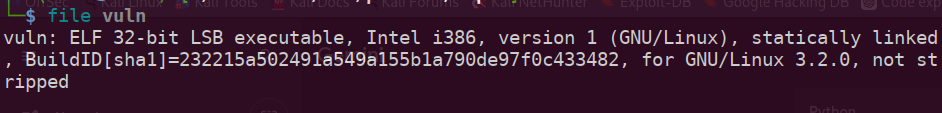
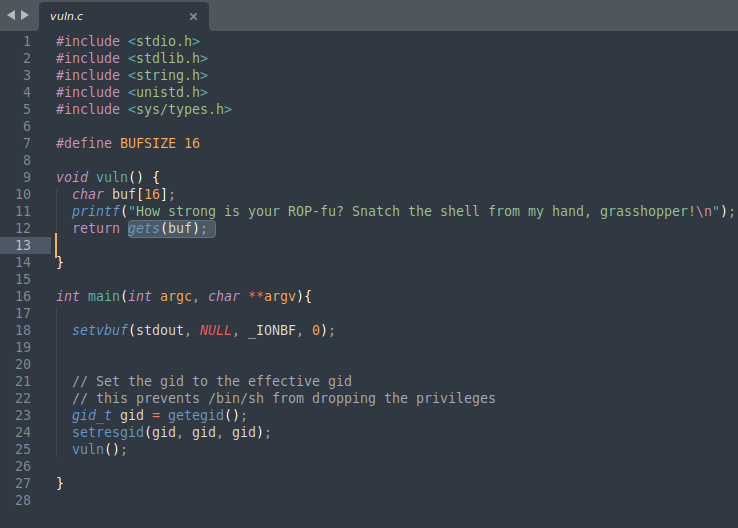
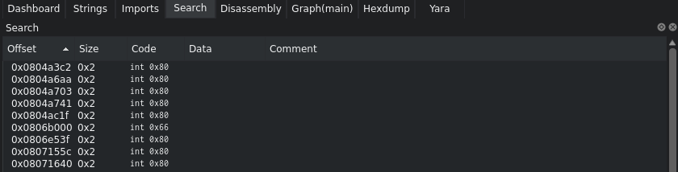
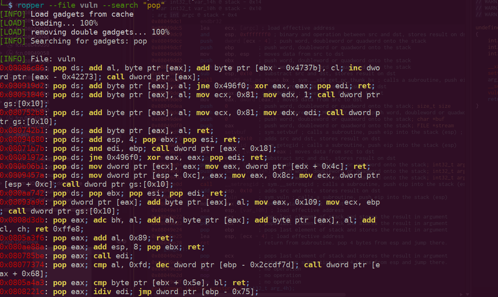
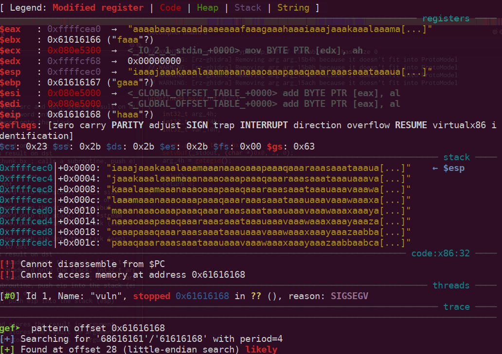
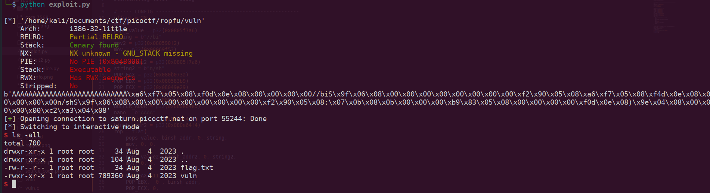

Bypassing NX with ROP: A Deep Dive into picoCTF 'Ropfu'

While solving Binary Exploitation challenges on picoCTF, I encountered Ropfu, a "hard" difficulty challenge. 
While many public writeups solve this by jumping to shellcode—possible here because the NX (No-Execute) bit is disabled—this isn't very "real-world."

In a modern production environment, the NX bit is almost always enabled. To make this a true learning experience, I decided to solve it using Return-Oriented Programming (ROP). 
By chaining together existing code snippets within the binary (known as gadgets), we can achieve a shell even if the stack is non-executable.

Phase 1: Initial Reconnaissance

First, we download the source code and the binary. Our first step is to analyze the file properties:

Key Observations:

   Statically Linked: This is a goldmine. Since all libraries are compiled directly into the binary, we have a massive pool of instructions to use as ROP gadgets. We don't need to leak libc addresses!

32-bit LSB: We are working with the x86 architecture.

The Vulnerability: Looking at the source code, we see the gets() function.

    Red Flag: gets() does not perform bounds checking. This allows us to overwrite the return address on the stack, leading to a stack-based buffer overflow.

Phase 2: The Strategy - Why ROP?

In a typical "easy" CTF, you might find a win() function that prints the flag. You simply overwrite the return address with the address of win(). In other cases, you might inject shellcode into the stack and jump to it.

However, if NX (No-Execute) were enabled, the CPU would refuse to execute code stored on the stack. ROP (Return-Oriented Programming) bypasses this by using code that is already marked as "executable" within the binary's code segment.

The Power of int 0x80

Our goal is to execute execve("/bin/sh", NULL, NULL). On 32-bit Linux, we trigger this via a software interrupt: int 0x80. To make this work, we must setup the registers as follows:
Register	Value	Purpose
EAX	0xb (11)	The syscall number for execve
EBX	Pointer to "/bin/sh"	The program to execute
ECX	0	Argument array (argv)
EDX	0	Environment array (envp)
Phase 3: Finding the Building Blocks (Gadgets)

A "gadget" is a small sequence of instructions ending in a ret. We use these to "pop" values from our stack into the registers.
1. Writing "/bin/sh" to Memory

Since the string "/bin/sh" isn't in the binary, we need to write it into a writable memory section like .data. We look for a "Write-What-Where" gadget, such as mov [edx], eax.

Using ropper:
Bash

2. Preparing the Syscall

We need gadgets to set up our registers and finally trigger the interrupt.
Bash

ropper --file ropfu --search "pop ebx; ret"
ropper --file ropfu --search "int 0x80"

Phase 4: Constructing the Exploit

We use pwntools to glue these gadgets together. The logic follows these steps:

   Overflow the buffer to reach the return pointer.
   
   

Chain 1: Use a pop edx; pop eax; ret gadget to put the address of .data into EDX and "//bi" into EAX.

Chain 2: Use the mov [edx], eax gadget to write the first 4 bytes to memory.

Chain 3: Repeat for the next 4 bytes ("n/sh").

Chain 4: Set EAX=11, EBX=&.data, ECX=0, EDX=0.

Final Blow: Call int 0x80.

Conclusion: The "Real World" Lesson

By using ROP, we have bypassed the need for an executable stack. Even if the administrators had turned on every protection (NX, Stack Canaries, etc.), as long as we have a buffer overflow and enough gadgets, the binary can be forced to exploit itself.

In this challenge, the static linking of the binary provided us with over 30,000 gadgets, making it trivial to find exactly what we needed. In dynamically linked binaries, we would first need to "leak" the address of the C library (libc) to find these gadgets, but the core principle remains the same.

Result:-

